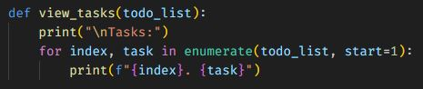
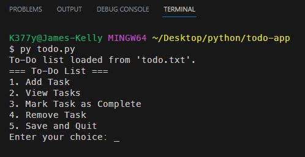
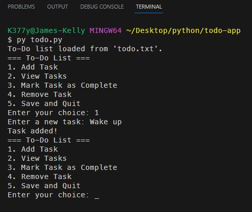
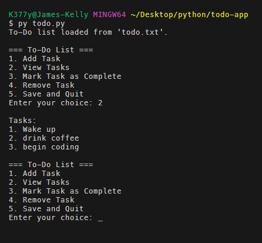
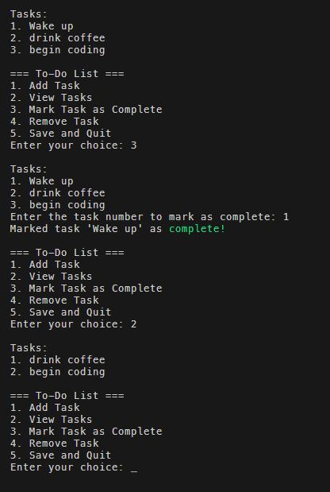
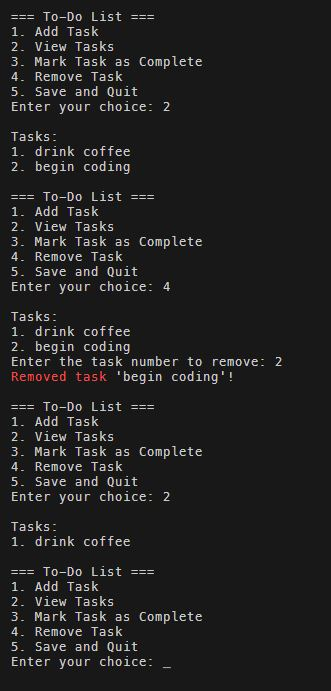

# TODO App

 

## *Description*
In this application, I wanted to practice manipulating an external file. I'm starting small with a .txt file. The user can create `todo` items, mark them as completed, view the items, and delete them. The data is stored in an external file once the save option is selected. 
 
 

### ***No modules were imported, but I did want to mention the `enumerate` function*** 
 - `enumerate` is a built-in Python function used to iterate over a sequence while keeping track of the index of each item in the sequence. 
 - It takes two arguments: the iterable (in this case, todo_list) and an optional start value for the index (in this case, start=1). 
 - In the view_tasks function below, enumerate is used to iterate over the todo_list and print each task along with its corresponding index. The index is incremented starting from 1, as specified by start=1. 
 - By using enumerate, the code can easily display the tasks with their respective indices, providing a numbered list of tasks when the function is called. 

 

## *Installation & Usage*
To install this app, simply clone the repository and run the `todo.py` file in your terminal.
 
When prompted: 
 - Make a selection by typing the corresponding number and pressing enter.
  

 
 

### 1) Add tasks to the todo list 
Select `1` to add a task to the list. You will be prompted to enter a task. Type the task and press enter.
 

 
 

### 2) View tasks in the todo list 
I have added a few tasks to the list. The tasks are displayed with their corresponding index.
 

 
 

### 3) Mark task as complete in the todo list 
Press `3`, and then select the task you would like to mark as completed.
 

 
 

### 4) Remove task in the todo list 
Press `4`, and then select the task you would like to remove.
 

 
 

### 5) Save the todo list 
It should be noted that the `todo.txt` file will not update until the user selects `5` to save the list.  
I may look into an auto-save feature for future applications.
 
 

## *Questions*
<h3>Portfolio:&emsp;<a href="https://jk377y.dev" target="_blank">https://jk377y.dev</a></h3>
<h3>Email:&emsp;<a href="mailto:jk377y@gmail.com" target="_blank">jk377y@gmail.com</a></h3>
<h3>LinkedIn:&emsp;<a href="https://www.linkedin.com/in/james-kelly-software-developer/" target="_blank">https://www.linkedin.com/in/james-kelly-software-developer/</a></h3>
<h3>GitHub:&emsp;<a href="https://github.com/jk377y" target="_blank">https://github.com/jk377y</a></h3>
 

## *License*

 Copyright (c) 2023 James Kelly
 Information on this license can be found at: (https://opensource.org/licenses/MIT)
